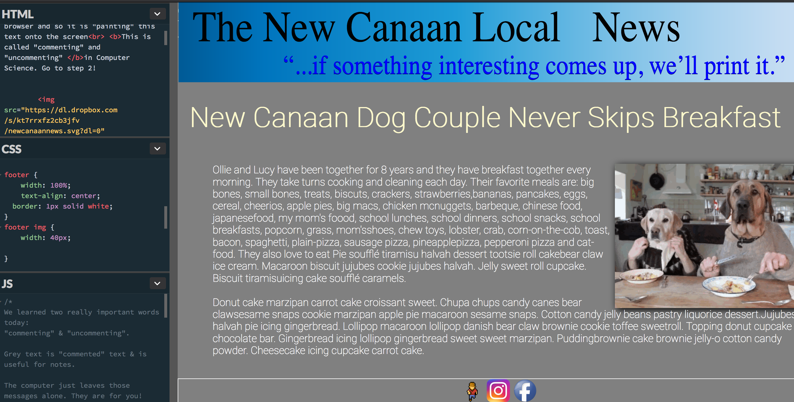
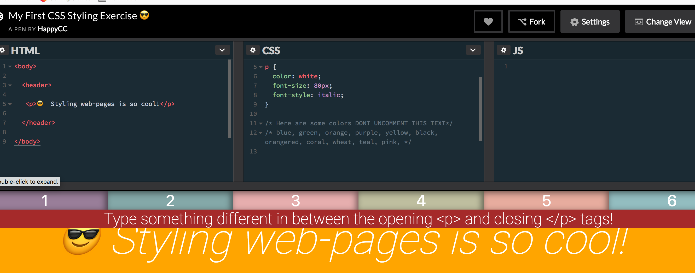
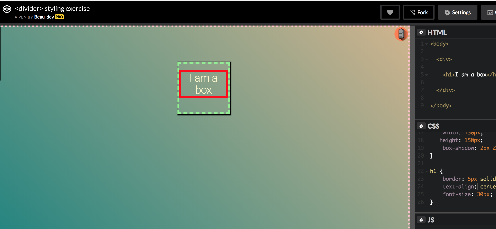
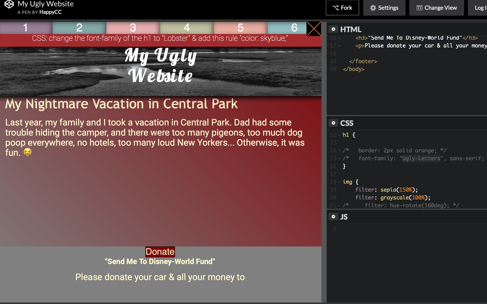

# codepen-exercises-for-HCC-students
A collection of exercises for JS/CSS/HTML with codepen integration


### I. HCC codepen template 

*[link to pen](https://codepen.io/happycodeclub/pen/OvmjpV)*

This code contains a template with animated menu for usability within codepen.

Much of the code is "hidden" in the "Stuff for Head" section of the Settings in Codepen.

There is a steps object in which yo`u may enter directions for students that will toggle (upon btn click) directly in the pen:

```javascript
 /**********Directions TEXT**********/
var steps = {
    step1: "Put your right foot in",
    step2: "Put your right foot out",
    step3: "Put your right foot in",
    step4: "And you shake it all about",
    step5: "Do the Hokey-Pokey and you turn yourself around",
    step6: "*CLAP* That's what it's all about"
};
```

*(These steps are entered in the "Stuff for Head" box in codepen settings.)*


## Lesson I Webcode/Codepen Intro Exercise



## Lesson II First styling Exercise



## Lesson III Divider styling Exercise



## Lesson VI My Ugly Website


